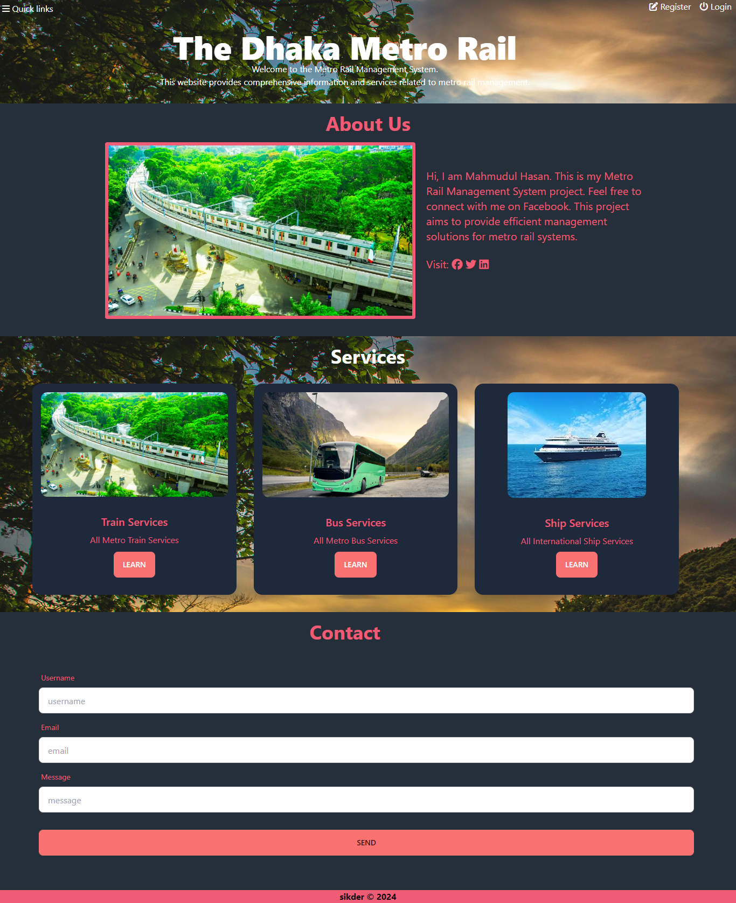

# Metro Rail Dynmaic Landing Page

This is a 6 section's dynamic landing page website where I've used HTML, CSS, JavaScript for frontend and PHP, MySQL for backend. As it is a practice project I also tried to implement some pages into backend only for my practice purpose.

## Landing Page UI

